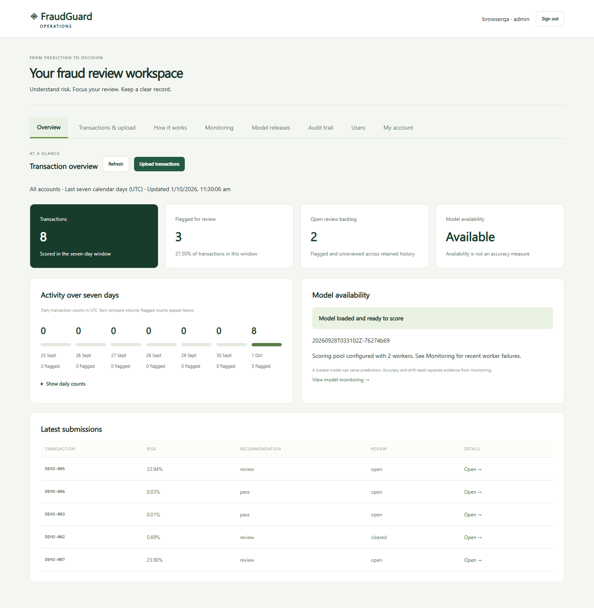

# FraudGuard

**Fraud screening and human review, with a new research track for point-in-time account behavior and verified online/offline feature parity.**

[Public sample demo](https://3.9.213.56/) · [API documentation](https://3.9.213.56/docs) · [Behavioral experiment](docs/BEHAVIORAL_RESEARCH.md) · [Operations](docs/OPERATIONS.md)

[](https://github.com/naveenvarma999/fraudguard/actions/workflows/ci.yml)
[](https://github.com/naveenvarma999/fraudguard/actions/workflows/security.yml)

The public demo is read-only sample scoring; accounts are operator-created. It was reachable on 2026-10-04. This is a single EC2 host, so availability and the IP can change. The v2.4 changes have not yet been deployed there.

## Measured benchmark results

The serving model uses the ULB credit-card benchmark: chronological fit, selection, calibration, policy and test windows, with boundary gaps and duplicate removal. Logistic regression won on selection data; a separate calibration window fits sigmoid calibration.

| Final temporal test | Result |
|---|---:|
| Transactions / fraud cases | 42,438 / 52 |
| Average precision | 0.6621 |
| ROC AUC | 0.9497 |
| Fraud recall | 76.92% |
| Review precision | 43.96% |
| Review rate | 0.2144% |
| Detected / missed fraud cases | 40 / 12 |
| False alerts | 51 |

[Model card](docs/DATA_AND_MODEL_CARD.md) · [Evaluation evidence](artifacts/benchmark/evaluation.json). Two historical days do not establish live banking performance. Inputs are `Amount` and anonymized `V1`–`V28`, not bank statements or card numbers.

## Behavioral scoring in v2.4

The authenticated `/v1/behavioral/predict` endpoint scores raw transaction events with supplied account history. It uses the same timing contract tested against the independent offline implementation. [Request example and API contract](docs/BEHAVIORAL_API.md).

| Evaluation | Average precision |
|---|---:|
| Original simulator, unseen accounts, **11 seeds** | **0.7798 mean; 0.6598–0.9240 range** |
| External Sparkov, chronological seen accounts | 0.5930 (133 fraud cases) |
| External Sparkov, held-out accounts | 0.6384 (10 fraud cases) |

[All seed reports](artifacts/behavioral/multiseed/summary.json) · [Sparkov results and provenance](docs/SPARKOV.md)

CI checks the reproduced dataset hash, feature contract, split counts, selected model, threshold and metrics against the committed reference. Training can create MLflow runs before fitting, track both candidate models and their parameters, and record failures.

## Run and reproduce

Use Python 3.12 in a virtual environment:

```bash
python -m pip install -r requirements.lock -r requirements-dev.txt
python -m pip install --no-deps -e .
pytest -q
node --test tests/dashboard.test.mjs
fraudguard behavioral-experiment --output artifacts/my-behavioral-run --seed 42
python -m fraudguard.reproduce --expected artifacts/behavioral/report.json --actual artifacts/my-behavioral-run/report.json
python -m fraudguard.multiseed --output artifacts/all-seeds
```

For the original benchmark:

```bash
fraudguard download --output data/creditcard.csv
fraudguard train --data data/creditcard.csv --output artifacts/my-run --seed 42
```

Data rights remain with their providers. Load only trusted serialized model bundles. For Docker setup, accounts, AWS updates, backups and recovery, use the single [operations guide](docs/OPERATIONS.md). The [Terraform configuration](infra/README.md) includes Elastic IP, S3 state configuration and a pinned-commit application bootstrap.

## Application and operations extras

The application includes authenticated CSV/JSON scoring, analyst reviews and audit history, TOTP login, request/concurrency limits, optional scoring workers, delayed-label monitoring, approved model activation/rollback, backups and configurable alerts. Login throttling now isolates client sources behind an explicitly trusted proxy, and requests rejected for busy local scoring capacity do not consume prediction quota.



[Project walkthrough](docs/WALKTHROUGH.md) · [Verification and deployment limits](docs/VERIFICATION.md)

## Repository history

The first public commit imported an already-developed local v2.3 snapshot. Earlier public feature-by-feature commits do not exist; the versioned guides described local iterations. This upgrade is recorded in genuine new commits, without reconstructing or backdating history. The old versioned guide paths now point to the consolidated operations guide.

## Limitations and authorship

Both behavioral datasets are synthetic. Sparkov is an independent external generator, not real banking data; the held-out cohort has only 10 fraud cases. The small internal simulation has roughly 10% fraud, deliberately informative behavior, and no realistic temporal drift. Its split comparisons test evaluation mechanics, not evidence that leakage necessarily inflates scores. Cold-start metrics with no fraud examples are reported as `null` with an insufficient-data status.

Behavioral scores are uncalibrated and use caller-supplied history, capped at 1,000 events. This endpoint is stateless; durable streaming ingestion, verified history completeness and a distributed feature store remain future work. The original V1–V28 workspace remains separate. The deployment has one host and coordinator; Terraform has not been applied, and local container validation remains dependent on a running Docker engine. See [verification](docs/VERIFICATION.md) for exactly what ran.

This project was developed with substantial AI assistance using OpenAI Codex, including implementation, tests and documentation. The decisions, tests, measured outputs and commit history are available for review. [Design decisions](docs/DECISIONS.md) explain equal-time exclusion, canonical ordering, unlabeled history and operational tradeoffs; AI assistance is not a substitute for understanding those choices.
