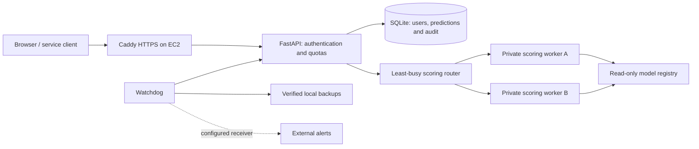

# FraudGuard

**An end-to-end machine learning system for transaction fraud screening and human review.**

FraudGuard turns a trained fraud model into a Docker-deployable application with authenticated uploads, a review workspace, model monitoring, controlled releases and operational recovery tools.

**Stack:** Python 3.12 · scikit-learn · FastAPI · SQLite · Docker Compose · AWS EC2 · JavaScript


## What it does

1. Accepts CSV or JSON batches containing `Amount` and anonymized `V1`–`V28` transaction features.
2. Calculates fraud probabilities and recommends **pass** or **manual review**.
3. Lets analysts investigate predictions, record decisions and add verified fraud outcomes.
4. Monitors feature drift and model performance as delayed labels become available.
5. Supports independently approved model releases, activation and rollback.

This is an engineering reference using the public ULB credit-card benchmark. It does not accept card numbers or ordinary bank statements, automatically block payments, or claim validation for live banking decisions.

## Model development and measured results

The experiment processed 284,807 transactions, removed exact duplicates, and used chronological fit, selection, calibration, policy and test windows with boundary gaps. A class-weighted logistic model outperformed four histogram gradient-boosting candidates on the selection window. Model complexity was not the selection criterion.

| Final temporal test | Result |
|---|---:|
| Transactions / fraud cases | 42,438 / 52 |
| Average precision | 0.6621 |
| ROC AUC | 0.9497 |
| Fraud recall | 76.92% |
| Review precision | 43.96% |
| Review rate | 0.2144% |
| Detected / missed fraud cases | 40 / 12 |
| False alerts | 51 |

The final test window was not used for model or threshold selection. See the [model card](docs/DATA_AND_MODEL_CARD.md), [evaluation data](artifacts/benchmark/evaluation.json) and [training walkthrough](docs/WALKTHROUGH.md). Results from two days of historical data are not evidence of real-world financial performance.

## Application and ML operations

- **Review workspace:** seven-day overview, role-scoped history, transaction detail pages, review timelines, upload feedback and an interactive architecture walkthrough.
- **Identity:** administrator and analyst accounts, salted scrypt password hashes, authenticator-app login, encrypted authenticator secrets, one-use recovery codes and expiring sessions.
- **Traffic control:** account request and transaction budgets, HTTP 429 retry guidance, bounded concurrency and an optional two-worker scoring pool with failover.
- **Monitoring:** version-specific drift checks, delayed-label performance, latency, resource telemetry and configurable alert delivery.
- **Model releases:** immutable local bundles, quality gates, independent approval, activation and rollback.
- **Recovery:** verified database/model backups, restore tools, deployment checks and an optional off-host S3 export script.
- **Validation:** 81 Python tests and seven JavaScript data tests passed locally, plus desktop/mobile browser workflows. CI and dependency-audit workflows are included; passing GitHub Actions is not claimed before a run.

## Architecture



The default deployment scores inside the API; the worker pool is optional. One coordinator and one host remain single points of failure. This is not AWS API Gateway, multi-host high availability or automatic scaling. API retries are not idempotent: after a lost response, check history before resubmitting.

## Run locally

Clone this repository and open a terminal in its root. Docker Desktop must be running with Linux containers.

**Windows PowerShell:**

```powershell
powershell -NoProfile -ExecutionPolicy Bypass -File .\scripts\Deploy-Docker.ps1
docker compose exec api python -m fraudguard.admin create-user admin --role admin
```

The first command creates local secrets, builds the image and checks a prediction. The second prompts privately for an administrator password. Open `http://localhost:8000/workspace`, sign in, leave the code blank for first-time authenticator setup, and save the generated recovery codes privately.

**Linux, with Docker Compose and Python 3 available:**

```bash
umask 077
test -e .env || python3 -c "import secrets; from pathlib import Path; Path('.env').write_text('API_KEY='+secrets.token_urlsafe(32)+'\n')"
python3 scripts/configure_security.py
bash scripts/Deploy-Checked.sh
bash scripts/Compose.sh exec api python -m fraudguard.admin create-user admin --role admin
```

Use a new random password of at least 12 characters. There are no default production accounts. Never commit `.env`, SSH keys, databases, backups or recovery codes.

To enable two scoring workers, create `.workers-enabled` and rerun `scripts/Deploy-Checked.sh` on Linux. Use `scripts/Compose.sh` for subsequent operations so the worker configuration remains applied. See [access and scaling](docs/ACCESS_SCALING_V22.md).

## Develop and reproduce

With Python 3.12:

```bash
python -m venv .venv
# Linux/macOS: source .venv/bin/activate
# Windows PowerShell: .\.venv\Scripts\Activate.ps1
python -m pip install -r requirements.lock -r requirements-dev.txt
python -m pip install --no-deps -e .
pytest -q
node --test tests/dashboard.test.mjs
```

Download the data separately and train into a new output directory:

```bash
fraudguard download --output data/creditcard.csv
fraudguard train --data data/creditcard.csv --output artifacts/my-run --seed 42
```

The raw dataset is not included. Review the original provider's terms; this repository does not grant rights to third-party data. Serialized model files are executable artifacts: load only trusted bundles.

## Screens and documentation

- [Transaction details](docs/screenshots/transaction-details.png)
- [Interactive system flow](docs/screenshots/system-flow.png)
- [Workspace v2.3 and AWS update instructions](docs/WORKSPACE_V23.md)
- [Authenticator login, quotas and workers](docs/ACCESS_SCALING_V22.md)
- [Backups, alerts and recovery](docs/HARDENING_V21.md)
- [Full project guide](docs/PROJECT_GUIDE.md)

Screenshots show local sample transactions. The EC2 deployment of v2.2 was confirmed by deployment logs; v2.3 source and interface tests are complete, with deployment verification tracked separately. Local load measurements are not AWS capacity guarantees.

## Repository layout

```text
src/fraudguard/       Training, inference, security, monitoring and UI
tests/               Model, API, access, recovery and workspace tests
scripts/             Deployment, load checks and operator helpers
artifacts/benchmark/  Trained bundle and measured evaluation
docs/                Model card, guides, runbooks and screenshots
ops/                 Optional backup-export service and timer
.github/workflows/   Tests, container checks and dependency audit
```
