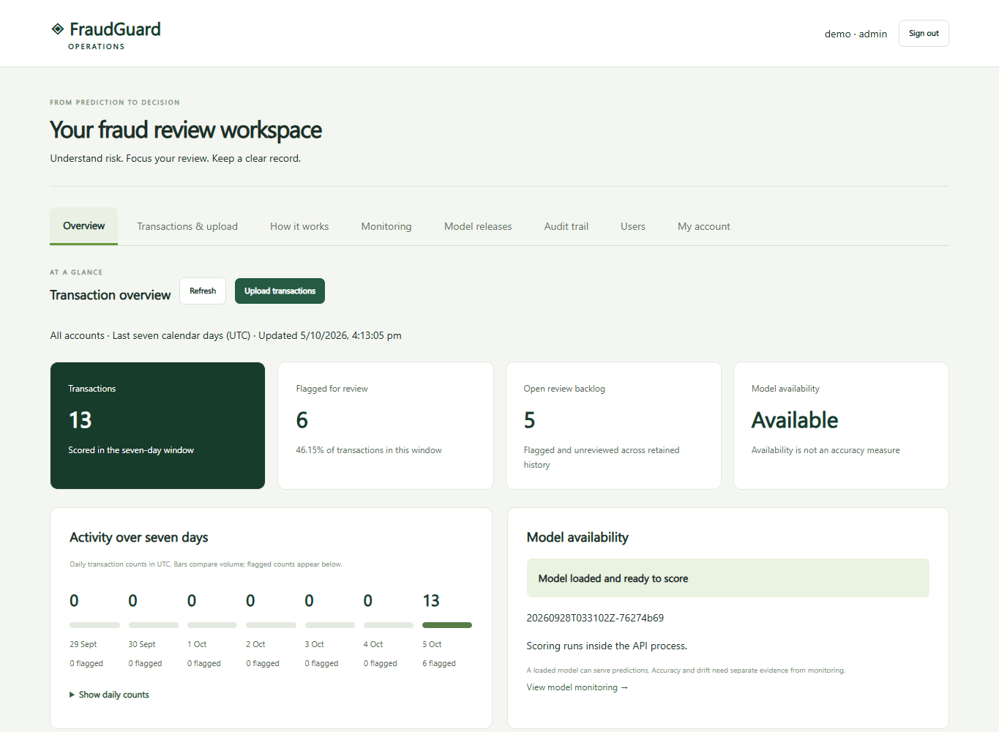

# FraudGuard

**Behavioural fraud screening with shared account history, human review and evidence-gated model releases.**

[Live workspace](https://3.9.213.56/workspace) · [API docs](https://3.9.213.56/docs) · [ML evidence](docs/ML_EVIDENCE.md) · [Model lifecycle](docs/LIFECYCLE.md)

[](https://github.com/naveenvarma999/fraudguard/actions/workflows/ci.yml)

**Deployment status:** HTTPS readiness and OpenAPI were verified on 2026-10-05, with certificate verification enabled. The live app reports **2.5.0**. CI passed on merged commit `c604ad0`. This branch prepares **2.6.0**; it is not yet deployed.

## Watch the workflow



Six actual local browser captures, displayed for ten seconds each: overview, submit, evidence, review history, monitoring and system flow. Synthetic demo records; this is a stepped walkthrough, not a production traffic recording.

## What the system does

Submit one transaction with an event ID, account/merchant tokens, time, amount and optional merchant category/home coordinates. The server derives prior account history across authorised users, estimates risk, and stores a reviewable prediction. Exact retries reuse saved results. Late events are retained for future features without issuing a misleading pass decision. Accounts without history require manual review.

Verified outcomes arrive separately from review opinions. They feed merchant-risk features only after their availability time, support monitoring, and can train a calibrated candidate from saved point-in-time features. Shadow scoring compares the candidate with the live model; a different administrator approves promotion after explicit evidence gates. TOTP, API quotas, audit records and verified backups support the workflow.

## ML findings, including what did not work

The new Sparkov study generated **523,605 transactions from 1,200 profiles / 1,197 active accounts**, with **282 fraud cases** in the unseen-account test. All five feature-group ablations are published.

| Model inputs | Unseen-account AP |
|---|---:|
| Original behavioural features | 0.66 |
| Add time of day | 0.80 |
| Add category and home-distance context | 0.32 |
| Full set including arrived-label merchant statistics | 0.55 |

The full candidate looked strongest on selection data but generalized worse later. It is shipped for **shadow evaluation**, not automatically promoted. This is a measured limitation and a reason to prefer prospective evaluation over adding features indiscriminately.

The calibrated full candidate has unseen AP **0.5501 (95% account-bootstrap interval 0.4263–0.6527)**, recall **80.85%**, and Brier score **0.01019**, compared with **0.03372** before calibration. AP/base-rate lift is **40.44**. Calibration, policy and final test use separate chronological partitions. These figures evaluate the model threshold; cold-start manual review is a separate policy.

[Protocol, ablation table, uncertainty and reproduction](docs/ML_EVIDENCE.md) · [Exact report](artifacts/study_v26/report.json) · [Generator provenance](artifacts/study_v26/provenance.json)

## Run and verify

Use Python 3.12:

```bash
python -m pip install -r requirements.lock -r requirements-dev.txt
python -m pip install --no-deps -e .
pytest -q
node --test tests/dashboard.test.mjs
```

Follow [Operations](docs/OPERATIONS.md) for Docker, accounts, AWS updates and backups. Start with these four documents: [ML evidence](docs/ML_EVIDENCE.md), [Lifecycle and capacity](docs/LIFECYCLE.md), [Operations](docs/OPERATIONS.md), and [Verification](docs/VERIFICATION.md). Older experiment and release documents are historical references.

## ULB baseline

The independent `/v1/predict` endpoint uses `Amount` and anonymised `V1`–`V28`. Its temporal test contains 42,438 transactions / 52 frauds: AP **0.6621**, recall **76.92%**, precision **43.96%**. It is retained as a calibrated comparison baseline, not an ordinary bank-statement parser. [Baseline model card](docs/DATA_AND_MODEL_CARD.md).

## Practical limits and authorship

Sparkov and the internal simulator are synthetic. The historical ULB benchmark does not establish current bank performance either. One coordinator and SQLite writer limit scale; the local load report is not AWS capacity. Shared history assumes one trusted organisation, not isolated tenants. Full cloud failover, an EBS migration on the current server, and prospective shadow outcomes remain unverified. Client-supplied raw events still require a trustworthy upstream source.

Built with substantial AI assistance using OpenAI Codex. Source, tests, measured outputs, design decisions and honest limitations are available for review. Understanding and validating the design remains the maintainer's responsibility.
