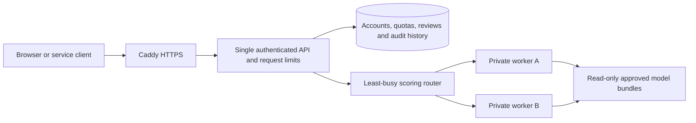

# FraudGuard 2.2: authenticator login, request limits and scoring workers

This release adds authenticator-app verification and bounded traffic handling. The optional worker configuration distributes scoring across two processes on the same server. It does not create AWS API Gateway, an AWS load balancer, new EC2 instances, or automatic scaling.

## What users see

1. Sign in with the username and password. Leave the code blank for initial setup.
2. In an authenticator app, choose **Add account / Enter a setup key**. Use the account name and private key shown by FraudGuard; select **time based**.
3. Enter the app's six-digit code to confirm. Save the eight recovery codes in a password manager. They are displayed once.
4. Sign in again with the next code from the app. The setup-confirmation code has already been used and cannot be reused.

Login requires password plus an authenticator code or one unused recovery code. Codes refresh every 30 seconds, tolerate one step of clock skew, and are accepted only once. Secrets use authenticated Fernet encryption with a separate deployment key. Recovery codes are stored as hashes. Five failed enrollment confirmations invalidate the enrollment attempt. Enrollment tokens expire after ten minutes and cannot access the workspace.

Compose requires MFA for every named user, including administrators. Existing accounts enroll on their next login; existing sessions without enrollment are rejected. Service API keys are machine credentials and do not use OTP. Password-manager autocomplete remains supported; the app never saves a plaintext password or bearer session in browser storage.

The setup uses a manual key, not a QR-code service. Do not share the setup key or recovery codes. For local Python development, set `REQUIRE_MFA=true` and provide `MFA_ENCRYPTION_KEY` to enable mandatory enrollment; Compose does this automatically.

## Request handling

| Protection | Behavior |
|---|---|
| Per-account predictions | Token bucket: capacity 60 requests, refill 1 per second |
| Per-account transaction volume | Capacity 3,000 transactions, refill 50 per second |
| All non-health HTTP routes | Process-wide capacity 120 requests, refill 60 per second |
| Login attempts | Existing limits: 5 per username and 30 per direct connection address per ten minutes |
| Prediction concurrency | At most four batches in flight at the coordinator |
| Worker concurrency | Two batches per worker; no unbounded application queue |
| Input | At most 100 transactions and 256 KiB per prediction request |

Account budgets are updated atomically in SQLite, survive API restarts, and apply across all sessions for the account. Every request using the shared service key uses the same service budget. The global admission bucket resets on process restart. Quotas apply to attempted admitted predictions, including worker failures. Clients should honor `Retry-After`, apply backoff and avoid immediate retry loops.

Excess traffic returns HTTP **429**. Exhausted inference capacity or unavailable workers returns **503**. Authentication is performed before account quotas are charged. Health routes bypass the application admission bucket so monitoring remains useful. These application controls do not replace network-level DDoS protection. Login address limits use the direct peer and can be shared by users behind Caddy; arbitrary forwarded IP headers are not trusted.

## Load-balancing architecture



The router chooses the least-busy eligible worker, with rotating tie breaks. A failing worker is excluded for ten seconds before a trial request is allowed again. Workers have no published host ports, use a separate internal key, and mount the state volume read-only. They score a requested immutable model version and digest; they do not write transactions, sessions or audit history. Each caches at most two model versions.

The coordinator captures model and threshold together before sending a batch. A concurrent model activation affects later batches, while the in-flight batch keeps its original version. Only the coordinator persists successful results. An internal scoring retry can use the other worker without creating duplicate records, because workers are read-only. A client retry of an entire successful API request is **not idempotent**; check history after a lost response before resubmitting.

Workers currently share one host and one durable registry volume. The API, SQLite, volume and host remain single points of failure. Do not scale the stateful `api` service or put the SQLite volume on a network filesystem. The worker pool does not add CPU or RAM to the EC2 instance. Container memory ceilings total roughly 1.5 GiB plus host overhead; measure headroom on the existing 2 GiB machine before sustained load. More workers may be slower for this small model because routing adds overhead.

## Update the existing AWS instance

The new archive preserves `.env`, the trained benchmark artifact, the database volume, and the existing HTTPS override. The deployment script generates missing encryption and worker keys without displaying them.

**On your Windows computer, in PowerShell:**

```powershell
scp -i "$env:USERPROFILE\Downloads\fraudguard-key.pem.pem" "C:\path\to\downloaded-updates\FraudGuard-Secure-Scaling-Update.tar.gz" ubuntu@YOUR_EC2_PUBLIC_IP:~/
ssh -o IdentitiesOnly=yes -i "$env:USERPROFILE\Downloads\fraudguard-key.pem.pem" ubuntu@YOUR_EC2_PUBLIC_IP
```

**Only after the prompt starts with `ubuntu@...`, run on AWS:**

```bash
cd ~/fraudguard
tar -czf ~/fraudguard-before-v22-$(date +%Y%m%d-%H%M%S).tar.gz src scripts pyproject.toml requirements.lock Dockerfile compose.yaml
tar -xzf ~/FraudGuard-Secure-Scaling-Update.tar.gz -C ~/fraudguard
touch .workers-enabled
sudo bash scripts/Deploy-Checked.sh
sudo bash scripts/Compose.sh ps
```

`touch .workers-enabled` enables the optional two-worker pool. Omit that line to deploy MFA and request limits with local scoring. The marker makes subsequent checked deployments retain the worker configuration. After enabling workers, use `scripts/Compose.sh` instead of plain `docker compose` for operations so all configuration files remain applied.

The script validates configuration, builds the image, waits for container health, verifies the application version and backup, and scores a smoke sample on **each** worker. If a deployment check fails it attempts to restore the previous API/monitor image. This is image rollback, not a database restore. A rollback to pre-2.2 code also restores that version's previous authentication behavior; it does not preserve new MFA enforcement. Inspect the rollback message before allowing public traffic again.

If the workspace has no named account yet:

```bash
sudo bash scripts/Compose.sh exec api python -m fraudguard.admin create-user naveen --role admin
```

Then open the existing `/workspace` URL and enroll. Back up the updated `.env` securely **separately from** the application backup archive. In particular, retain `MFA_ENCRYPTION_KEY` unchanged: restored databases need this same key to decrypt authenticator secrets. Do not commit or send this file. Existing HTTPS and firewall rules stay in use; workers need no new public ports.

To take a fresh backup after enrollment:

```bash
sudo bash scripts/Compose.sh exec -T monitor python -m fraudguard.backups create
```

Full snapshots remove pending enrollment tokens and sessions. They preserve encrypted MFA secrets and the recovery-code state at snapshot time. Restoring an old snapshot rolls back security state too; review recovery-code usage since that snapshot and reset affected accounts' MFA if necessary.

If a user loses both phone and recovery codes, the operator must independently verify their identity before running:

```bash
sudo bash scripts/Compose.sh exec api python -m fraudguard.admin reset-mfa USERNAME
```

This revokes sessions and requires enrollment again. Resetting only a password deliberately does not bypass MFA.

To disable the worker pool while retaining MFA and request limits:

```bash
sudo bash scripts/Compose.sh stop worker-a worker-b
rm -- .workers-enabled
sudo bash scripts/Deploy-Checked.sh
```

Stopped worker containers may remain for later reuse. Do not use `down -v`: that would remove durable data.

## Verification and limits

The automated tests cover RFC 6238 vectors, encrypted secret storage, authenticator/recovery-code replay, simultaneous code reuse, enrollment expiry and attempts, backup restoration, concurrent account limits, worker authentication, corrupt bundles, failover, complete worker outage, and model activation during an in-flight batch.

Browser checks cover initial enrollment, recovery login, mobile layout, scoring through workers, worker monitoring, logout and replay rejection. A local HTTP smoke run used one coordinator and two real scoring processes, with 20 requests, eight transactions per request and concurrency four. See [the measured report](../artifacts/operations/scaling_local_http.json); it is not an AWS capacity benchmark or a before/after performance comparison.

Docker Compose configuration is validated locally. Full Linux-container startup and live AWS deployment still require running the supplied deployment steps. No new AWS infrastructure has been provisioned.

References: [RFC 6238](https://www.rfc-editor.org/rfc/rfc6238) defines the authenticator algorithm and replay rules. [Fernet documentation](https://cryptography.io/en/latest/fernet/) describes authenticated symmetric encryption and protecting its key.
