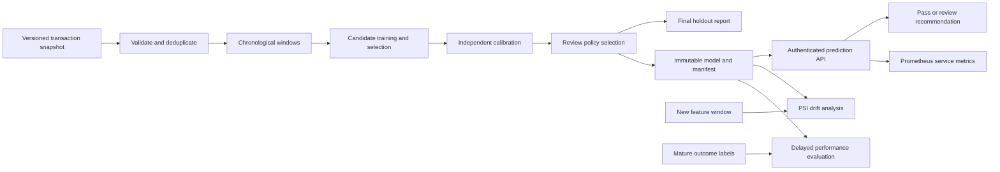

# Architecture

## Boundaries

The training process is a local batch job. The inference service loads exactly one fixed release at startup. No endpoint uploads, retrains, or swaps a model. To promote a model, deploy a new image or point a new process at an immutable release and verify readiness.

The API is stateless and does not persist transaction data. `transaction_id` is a response correlation key, not an idempotency ledger. Since scoring has no business side effects, retrying the same input with the same model is safe. The caller owns persistence, review-queue delivery, and retries.

The service uses one worker per container, with at most four simultaneous model calls and two native numerical threads. Scale containers rather than increasing worker count without redesigning Prometheus aggregation. The local semaphore bounds model computation, not all HTTP requests; Uvicorn and the ingress must bound connections and queues.

## Artifact trust

`manifest.json` records the model hash and schema. `load_bundle` verifies them before deserializing. Artifact storage and the image supply chain must be trusted: a checksum alongside a file is not a signature. The release pipeline must enforce access control and, for a live deployment, signed/attested images or equivalent provenance.

## Monitoring boundaries

Prometheus metrics are process-local and reset after restart. They are aggregate service measures, not durable audit records. Metrics access requires the same API key as predictions in this reference implementation; use separate credentials and network policies in a shared environment.

The offline drift command compares raw feature distributions using stored training bins. It does not automatically collect live features, schedule jobs, send alerts, or retrain. A production data pipeline must provide windowed snapshots and mature labels. Avoid storing payment-sensitive raw data in monitoring labels or logs.
