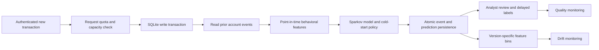

# Architecture

The headline workflow is behavioral screening with server-owned history. Its trusted model is bundled with the application. The original ULB model remains an independent baseline and supports its existing approved-release registry and optional scoring workers. Both models write to the same review workspace, but their features and quality metrics remain separate.

Behavioral ingestion is ordered per authenticated owner/account and uses one SQLite writer. It accepts no supplied history. Retried event IDs return saved responses; conflicting or late events fail. All equal-time events are excluded from features. See [API contract](BEHAVIORAL_API.md) for exact timing and retention semantics.

The service has one coordinator and four bounded inference slots. Optional worker load balancing applies to ULB scoring, not the behavioral database transaction. Prometheus counters reset after process restart; SQLite holds durable prediction and audit records. Neither multiple local workers nor EBS provides automatic failover.

Checksummed model files still require a trusted artifact supply chain. The behavioral model artifact and manifest are included in the database backup for recovery and audit. Startup loads the configured trusted bundle; recovering an older model requires deliberate operator selection of the matching artifact, not automatic deserialization from an uploaded archive.

For new Terraform hosts, encrypted EBS holds workspace data, backups and application secrets independently of the root disk. The volume and Elastic IP have deletion guards; the instance can be replaced. Bootstrap is for initial provisioning, and the checked deployment script applies app updates. Off-host backups and a tested restore remain necessary. No Terraform apply is claimed; see [infrastructure status](../infra/README.md).
